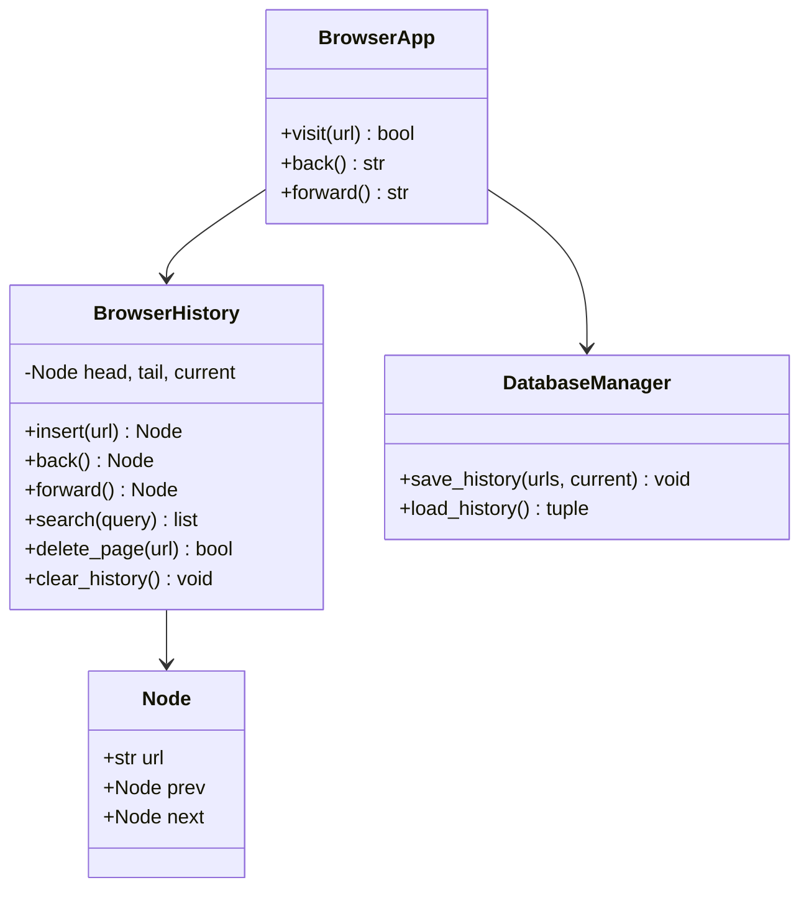
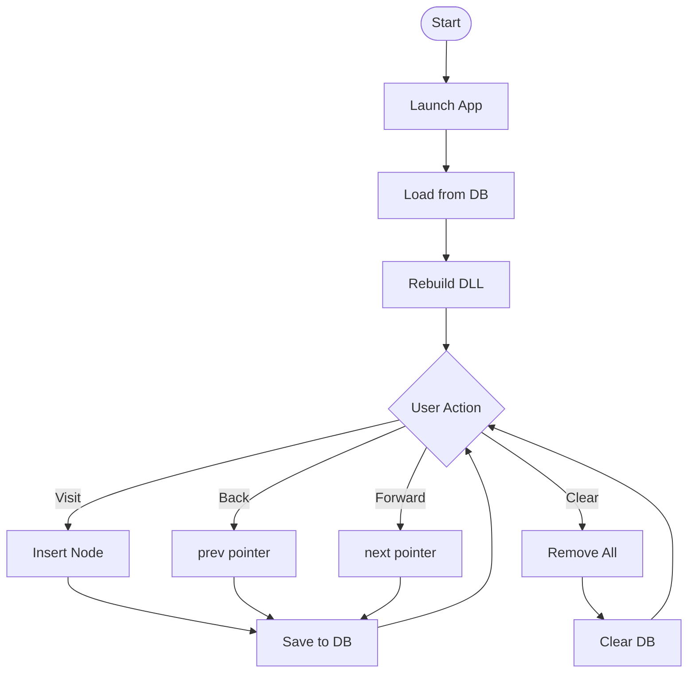
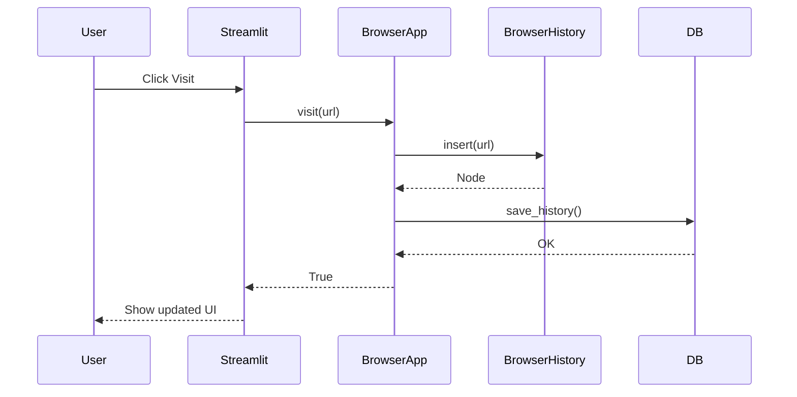
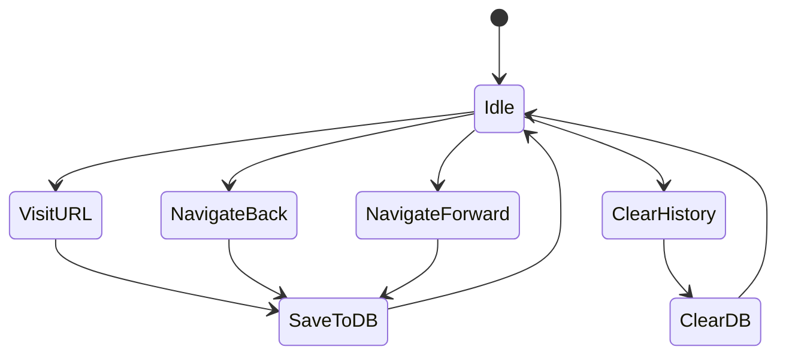
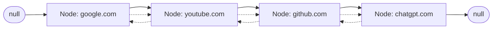

# 🌐 Browser History Manager using Doubly Linked List

## Overview

A complete, production-quality educational Python application that simulates real browser history navigation (Chrome/Edge) using a **Doubly Linked List** data structure with a **Streamlit** interface and **SQLite** persistence.

## Problem Statement

Modern browsers maintain backward/forward navigation history. This project demonstrates how browsers internally implement history using a Doubly Linked List, where each node points both forward and backward — enabling O(1) back/forward navigation.

## Objectives

- Simulate real browser history using Doubly Linked List
- Demonstrate prev/next pointer traversal
- Provide Streamlit-based visual UI
- Persist history to SQLite
- Visualize linked list structure dynamically

## Features

- ✅ Visit websites (insert into history)
- ✅ Back / Forward navigation
- ✅ Search history
- ✅ Delete individual pages
- ✅ Clear all history
- ✅ Delete forward history
- ✅ SQLite persistence (auto-save/load)
- ✅ Linked list visualization with current node highlight
- ✅ Position indicator
- ✅ Database status panel

## Tech Stack

| Technology | Purpose |
|-----------|---------|
| Python 3.12+ | Core language |
| Streamlit | Web UI framework |
| SQLite | Local persistence |
| Doubly Linked List | Core data structure |
| OOP | Modular architecture |

## Folder Structure

```
browser-history-manager/
│
├── app.py                # Streamlit UI entry point
├── browser.py            # BrowserApp business logic
├── linked_list.py        # Doubly Linked List implementation
├── models.py             # Node class
├── database.py           # SQLite operations
├── utils.py              # URL validation & helpers
├── requirements.txt      # Dependencies
├── README.md             # Documentation
├── browser_history.db    # SQLite database (auto-created)
│
├── assets/
│   ├── architecture.png  # Architecture diagram
│   ├── linkedlist.png    # Linked list diagram
│   └── ui.png            # UI screenshot
│
└── diagrams/
    ├── class_diagram.mmd
    ├── flowchart.mmd
    ├── sequence_diagram.mmd
    ├── activity_diagram.mmd
    └── linkedlist_diagram.mmd
```

## Installation

```bash
pip install -r requirements.txt
```

## Running the Application

```bash
streamlit run app.py
```

## Screenshots

*[Screenshots placeholder — add assets/ui.png etc.]*

---

## How Browser History Works

1. Every visited URL becomes a **Node** in the Doubly Linked List.
2. The **current** pointer tracks where you are.
3. **Back** moves `current = current.prev`.
4. **Forward** moves `current = current.next`.
5. Visiting a new URL **deletes all forward history** (just like a real browser).
6. Every change auto-saves to SQLite.

---

## How Doubly Linked List Works

```
[null] ⇄ [google.com] ⇄ [youtube.com] ⇄ [github.com] ⇄ [null]
                ↑                            ↑
              head                       current
```

- Each node stores `url`, `prev` (pointer to previous), `next` (pointer to next).
- `head` points to the first node.
- `tail` points to the last node.
- `current` points to the active page.

## Why Doubly Linked List instead of Singly Linked List?

| Feature | Singly Linked List | Doubly Linked List |
|---------|-------------------|-------------------|
| Back navigation | O(n) — must traverse from head | O(1) — use prev pointer |
| Forward navigation | O(1) | O(1) |
| Memory per node | 1 pointer | 2 pointers |
| Complexity | Simple | Slightly more complex |

Browsers need **O(1) back navigation**, so they use Doubly Linked Lists.

---

## SQLite Explanation

SQLite stores the linked list linearly:
- `url` — the website address
- `visited_time` — timestamp
- `position` — index in the list
- `is_current` — boolean flag for current page

On startup, rows are loaded by position order and the Doubly Linked List is reconstructed. `is_current` identifies where to place the `current` pointer.

---

## Project Workflow

```
Start → Load from DB → Rebuild DLL → 
  ↓
User visits URL → Insert node → Delete forward → Save to DB
  ↓
User clicks Back → current = current.prev → Save to DB
  ↓
User clicks Forward → current = current.next → Save to DB
  ↓
User clears → Remove all nodes → Clear DB
```

---

## Complete Code Explanation

### Class: `Node` (`models.py`)

```python
class Node:
    def __init__(self, url: str):
        self.url = url
        self.prev = None  # pointer to previous node
        self.next = None  # pointer to next node
```

A node represents a single visited URL. The `prev` and `next` pointers create the doubly linked structure.

---

### Class: `BrowserHistory` (`linked_list.py`)

This is the core data structure class.

| Method | Purpose |
|--------|---------|
| `insert(url)` | Creates a new node, inserts after current, deletes forward history |
| `back()` | Moves current to `current.prev` |
| `forward()` | Moves current to `current.next` |
| `show_current()` | Returns current URL |
| `show_history()` | Returns all URLs with current flag |
| `search(query)` | Finds matching URLs |
| `delete_page(url)` | Removes a specific node |
| `clear_history()` | Removes all nodes |
| `delete_forward_history()` | Removes nodes after current |

**Insert algorithm:**
```
1. Create new Node(url)
2. Set node.prev = current
3. Set current.next = node (after deleting current.next chain)
4. Set current = node
5. Set tail = node
```

**Back algorithm:**
```
1. If current.prev is None → return None (can't go back)
2. Set current = current.prev
3. Return current.url
```

**Forward algorithm:**
```
1. If current.next is None → return None (can't go forward)
2. Set current = current.next
3. Return current.url
```

**Delete Forward History:**
```
1. Start from current.next
2. For each node, unlink prev/next references
3. Set current.next = None
4. Set tail = current
```

---

### Class: `DatabaseManager` (`database.py`)

Handles all SQLite operations.

| Method | Purpose |
|--------|---------|
| `save_history(urls, current_url)` | Clears table, inserts all URLs |
| `load_history()` | Returns (urls_list, current_url) |
| `clear_all()` | Deletes all rows |
| `get_record_count()` | Returns row count |

---

### Class: `BrowserApp` (`browser.py`)

The facade that connects the UI, linked list, and database.

| Method | Purpose |
|--------|---------|
| `visit(url)` | Validates, inserts, saves |
| `back()` | Navigates back, saves |
| `forward()` | Navigates forward, saves |
| `search(query)` | Delegates to BrowserHistory |
| `delete_page(url)` | Delegates, saves |
| `clear_history()` | Clears both list and DB |
| `delete_forward_history()` | Delegates, saves |
| `sync_database()` | Forces a save |

---

## Database Explanation

**Database file:** `browser_history.db`

**Table: `history`**

| Column | Type | Description |
|--------|------|-------------|
| id | INTEGER (PK) | Auto-increment |
| url | TEXT | Website URL |
| visited_time | TEXT | ISO timestamp |
| position | INTEGER | Order in list |
| is_current | INTEGER | 1 if current page |

On every visit/back/forward/delete, the entire list is saved to the database. On startup, the list is reconstructed from the database.

---

## Time Complexity

| Operation | Time | Space |
|-----------|------|-------|
| Visit (insert) | O(1)* | O(1) |
| Back | O(1) | O(1) |
| Forward | O(1) | O(1) |
| Search | O(n) | O(1) |
| Delete by URL | O(n) | O(1) |
| Clear history | O(n) | O(1) |
| Delete forward | O(k) | O(1) |
| Save to DB | O(n) | O(n) |
| Load from DB | O(n) | O(n) |

\* O(k) for the forward history deletion that occurs during insert.

## Space Complexity

- **Linked List:** O(n) where n = number of visited URLs
- **Database:** O(n) on disk

## Advantages

- True O(1) back/forward navigation
- No index shifting (unlike arrays)
- Dynamic size (no pre-allocation)
- Intuitive pointer-based navigation mirrors real browser behavior
- Persistence across sessions

## Limitations

- Search is O(n) (no hash index)
- Delete by URL requires traversal
- Memory overhead of 2 pointers per node
- No support for concurrent access

## Future Enhancements

- Bookmark/favorites support
- History grouped by date
- Export/import history
- Fuzzy search
- Multi-tab support
- Undo delete
- Dark/light theme toggle
- Session restore

## Learning Outcomes

After studying this project, you will understand:
- ✅ Doubly Linked List implementation in Python
- ✅ Real-world application of prev/next pointers
- ✅ Browser history internal architecture
- ✅ SQLite persistence with Python
- ✅ Streamlit UI development
- ✅ Modular OOP project design
- ✅ Time and space complexity analysis

---

## Diagrams

### Class Diagram



### Flowchart



### Sequence Diagram



### Activity Diagram



### Linked List Memory Diagram



### Browser Navigation Diagram

```
History: [A] ⇄ [B] ⇄ [C*] ⇄ [D] ⇄ [E]
                        ↑
                      current

Back:    [A] ⇄ [B*] ⇄ [C] ⇄ [D] ⇄ [E]
                   ↑
                 current

Forward: [A] ⇄ [B] ⇄ [C*] ⇄ [D] ⇄ [E]
                        ↑
                      current

Visit F: [A] ⇄ [B] ⇄ [C] ⇄ [F*]
                             ↑
                           current
          (D and E are deleted)
```

### Database ER Diagram

```
┌──────────────────────────────────────┐
│              history                  │
├──────────────────────────────────────┤
│ PK │ id           │ INTEGER          │
│    │ url          │ TEXT             │
│    │ visited_time │ TEXT             │
│    │ position     │ INTEGER          │
│    │ is_current   │ INTEGER (0/1)    │
└──────────────────────────────────────┘
```

### Application Architecture Diagram

```
┌──────────┐    ┌──────────┐    ┌──────────┐
│ Streamlit │───▶│BrowserApp│───▶│BrowserHis│
│   (UI)    │    │ (Facade) │    │  (DLL)   │
└──────────┘    └──────────┘    └──────────┘
                       │
                       ▼
                 ┌──────────┐    ┌──────────┐
                 │DatabaseMa│───▶│  SQLite  │
                 │  (Persistence) │  (File)  │
                 └──────────┘    └──────────┘
```

---

## Algorithm Explanations

### Visit

**Purpose:** Add a new URL to history.

**Algorithm:**
1. Validate URL format
2. Check for duplicate current URL
3. Create a new Node with the URL
4. Set `node.prev = current`
5. Delete all nodes after `current` (forward history)
6. Set `current.next = node`
7. Set `current = node`
8. Set `tail = node`
9. Save to database

**Time Complexity:** O(1) average, O(k) due to forward history deletion
**Space Complexity:** O(1)

### Back

**Purpose:** Navigate to the previous page.

**Algorithm:**
1. If `current.prev` is None, return None
2. Set `current = current.prev`
3. Save to database
4. Return `current.url`

**Time Complexity:** O(1)
**Space Complexity:** O(1)

### Forward

**Purpose:** Navigate to the next page.

**Algorithm:**
1. If `current.next` is None, return None
2. Set `current = current.next`
3. Save to database
4. Return `current.url`

**Time Complexity:** O(1)
**Space Complexity:** O(1)

### Delete Forward History

**Purpose:** Remove all nodes after current (real browser behavior).

**Algorithm:**
1. Start from `current.next`
2. For each node, unlink `prev` and `next`
3. Decrement size for each removed node
4. Set `current.next = None`
5. Set `tail = current`

**Time Complexity:** O(k) where k = number of forward nodes
**Space Complexity:** O(1)

### Search

**Purpose:** Find URLs containing a search query.

**Algorithm:**
1. Start from `head`
2. For each node, check if query is in URL (case-insensitive)
3. Collect matching nodes with their index and current flag
4. Return results

**Time Complexity:** O(n)
**Space Complexity:** O(1) (excluding output)

### Clear History

**Purpose:** Remove all visited URLs.

**Algorithm:**
1. Start from `head`
2. For each node, store `next`, then unlink `prev`/`next`
3. Set `head = tail = current = None`
4. Set `size = 0`
5. Delete all records from database

**Time Complexity:** O(n)
**Space Complexity:** O(1)

### Database Synchronization

**Purpose:** Persist the in-memory linked list to SQLite.

**Algorithm:**
1. Traverse from `head` to `tail`
2. Collect all URLs in order
3. Note the current URL
4. `DELETE FROM history` (clear table)
5. `INSERT` each URL with position and is_current flag
6. Commit transaction

**Time Complexity:** O(n)
**Space Complexity:** O(n) for the URL list

---

## Educational Section

### What is a Doubly Linked List?

A Doubly Linked List is a linear data structure where each element (node) contains:
- **Data** (the URL)
- **Prev pointer** → reference to the previous node
- **Next pointer** → reference to the next node

Unlike arrays, elements are not stored in contiguous memory — each node can be anywhere in RAM, and pointers connect them.

### Why browsers use it?

- **Back button** must be instant — O(1) via `prev` pointer
- **Forward button** must be instant — O(1) via `next` pointer
- History size is **dynamic** — no pre-allocation needed
- **Delete forward history** is natural — just remove the `next` chain

### Difference between arrays and linked lists

| Feature | Array | Linked List |
|---------|-------|-------------|
| Memory | Contiguous | Non-contiguous |
| Access | O(1) index | O(n) traversal |
| Insert/Delete | O(n) shift | O(1) pointer update |
| Size | Fixed / dynamic (list) | Always dynamic |
| Cache locality | High | Low |

### Difference between singly and doubly linked lists

| Feature | Singly | Doubly |
|---------|--------|--------|
| Pointers | 1 per node | 2 per node |
| Back traversal | O(n) from head | O(1) via prev |
| Memory | Lower | Higher (extra pointer) |
| Complexity | Simpler | Slightly more complex |

### Real-world applications

- Browser history (forward/back)
- Music player playlist (next/previous)
- Image viewer (next/previous)
- Undo/Redo in editors
- LRU Cache
- Navigation systems

### Advantages

- O(1) bidirectional navigation
- Dynamic size
- No index shifting on insert/delete
- Intuitive pointer model

### Disadvantages

- O(n) search
- Extra memory for two pointers per node
- No random access
- Slightly more complex implementation than singly linked list

---

## Credits

Built as an educational project to demonstrate Doubly Linked Lists, SQLite persistence, and Streamlit UI development.

## License

MIT License — free to use, modify, and distribute.
