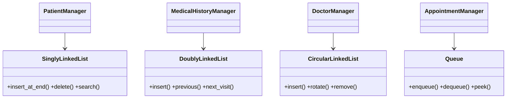
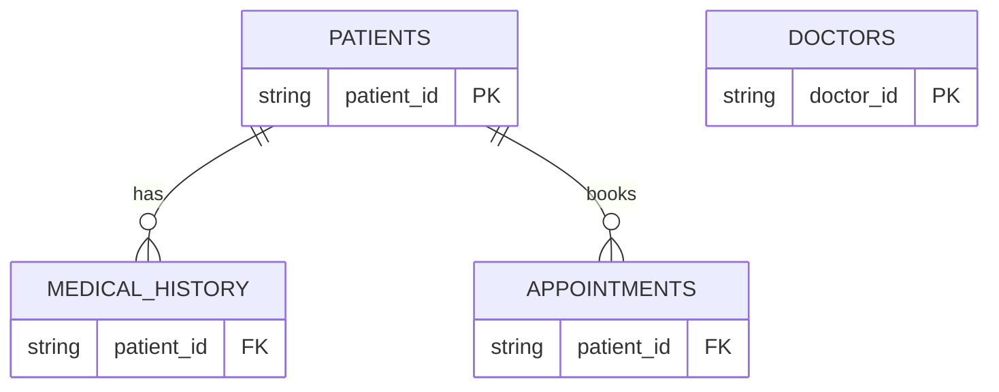

# 🏥 Hospital Management System

## Overview

A complete, production-quality **Hospital Management System** built with **Python**, **Streamlit**, **SQLite**, and **four different linked list implementations**. Each hospital module intentionally uses a different linked list data structure to demonstrate real-world applications of data structures.

## Tech Stack

| Technology | Purpose |
|-----------|---------|
| Python 3.12+ | Core language |
| Streamlit | Web UI framework |
| SQLite | Local persistence |
| Singly Linked List | Patient records |
| Doubly Linked List | Medical history |
| Circular Linked List | Doctor duty rotation |
| Queue (Linked List) | Appointment queue |

## Features

- **Dashboard** — KPI cards, recent patients, appointment queue, doctor rotation
- **Patient Management** — Add, update, delete, search patients (Singly Linked List)
- **Medical History** — Per-patient visit timeline with back/forward navigation (Doubly Linked List)
- **Doctor Duty Rotation** — Circular rotation with visual active doctor indicator (Circular Linked List)
- **Appointment Queue** — Book, cancel, complete appointments FIFO (Queue)
- **Reports & Analytics** — Blood group, age, department, doctor workload charts
- **Linked List Visualizer** — Interactive node-by-node visualization of all data structures

## Folder Structure

```
hospital_management/
├── app.py                # Streamlit UI (multi-page)
├── patient.py            # Patient Manager (Singly Linked List)
├── doctor.py             # Doctor Manager (Circular Linked List)
├── appointment.py        # Appointment Manager (Queue)
├── medical_history.py    # Medical History Manager (Doubly Linked List)
├── linked_list.py        # All linked list implementations
├── database.py           # SQLite persistence layer
├── dashboard.py          # Dashboard rendering
├── reports.py            # Charts and analytics
├── visualizer.py         # Linked list visualization
├── utils.py              # Helper functions
├── requirements.txt      # Dependencies
├── hospital.db           # SQLite database (auto-created)
├── README.md
├── assets/               # Screenshots
└── diagrams/             # Mermaid diagram files
```

## Installation

```bash
pip install -r requirements.txt
```

## Running

```bash
streamlit run app.py
```

## How Linked Lists Are Used

### 1. Patient Records — Singly Linked List

```
[head] → PAT001 → PAT002 → PAT003 → None
```

Why Singly? Patient records only need **forward traversal** (listing all patients). No need to go backward. Singly uses less memory (1 pointer per node vs 2).

| Operation | Time | Space |
|-----------|------|-------|
| Add patient | O(1) at head, O(n) at end | O(1) |
| Delete patient | O(n) search | O(1) |
| Update patient | O(n) search | O(1) |
| Search by name | O(n) | O(1) |
| List all | O(n) | O(1) |

### 2. Medical History — Doubly Linked List

```
[null] ⇄ Visit1 ⇄ Visit2 ⇄ Visit3 ⇄ [null]
```

Why Doubly? Medical history needs **bidirectional traversal** — "Previous Visit" and "Next Visit" buttons. The `prev` pointer makes going back O(1).

| Operation | Time | Space |
|-----------|------|-------|
| Add visit | O(1) at tail | O(1) |
| Previous visit | O(1) via prev | O(1) |
| Next visit | O(1) via next | O(1) |
| Delete visit | O(n) | O(1) |

### 3. Doctor Duty Rotation — Circular Linked List

```
DrA → DrB → DrC → DrA
↑                  ↑
|                  └── tail.next = head
current
```

Why Circular? Doctor duty rotation is a **cyclic process** — after the last doctor, it wraps back to the first. Circular Linked List naturally models this with `tail.next = head`.

| Operation | Time | Space |
|-----------|------|-------|
| Add doctor | O(n) | O(1) |
| Remove doctor | O(n) | O(1) |
| Rotate duty | O(1) | O(1) |
| Show current | O(1) | O(1) |

### 4. Appointment Queue — Queue (Linked List)

```
[front] → Appt1 → Appt2 → Appt3 → [rear]
```

Why Queue? Appointments are processed **First-In-First-Out** (FIFO). A Queue backed by a linked list gives O(1) enqueue and dequeue without the shifting overhead of an array.

| Operation | Time | Space |
|-----------|------|-------|
| Book (enqueue) | O(1) | O(1) |
| Complete (dequeue) | O(1) | O(1) |
| Cancel (remove) | O(n) | O(1) |
| Peek | O(1) | O(1) |

## Algorithms Explained

### Add Patient (Singly Linked List Insert at End)
1. Create new SLLNode with patient data
2. If head is None, set head = new node
3. Else traverse to tail, set tail.next = new node
4. Save all patients to SQLite

### Navigate Medical History (Doubly Linked List)
- **Previous**: `current = current.prev` (O(1))
- **Next**: `current = current.next` (O(1))
- Each visit node stores prev and next pointers for bidirectional travel

### Rotate Doctor Duty (Circular Linked List)
1. `current = current.next`
2. If current exceeds last node, it wraps to head automatically
3. The circular structure means no special wrap-around logic needed

### Complete Appointment (Queue Dequeue)
1. Save front node data
2. `front = front.next`
3. If front becomes None, set rear = None
4. Return saved data

## Database (SQLite)

**File:** `hospital.db`

**Tables:**
- `patients` — patient_id, name, age, gender, contact, blood_group
- `doctors` — doctor_id, name, department, shift
- `appointments` — id, patient_id, patient_name, doctor_name, department, appointment_date, status
- `medical_history` — id, patient_id, visit_date, diagnosis, prescription, doctor_name

On every change, all records are deleted and re-inserted to keep the database in sync with the in-memory linked lists. On startup, all data is loaded from SQLite and linked lists are reconstructed.

## Time Complexity Summary

| Module | Operation | Time | Space |
|--------|-----------|------|-------|
| Patient | Add | O(n) | O(1) |
| Patient | Search | O(n) | O(1) |
| Medical | Add Visit | O(1) | O(1) |
| Medical | Previous/Next | O(1) | O(1) |
| Doctor | Rotate | O(1) | O(1) |
| Doctor | Add | O(n) | O(1) |
| Appointment | Book | O(1) | O(1) |
| Appointment | Complete | O(1) | O(1) |

## Mermaid Diagrams

### Class Diagram


### ER Diagram


## Advantages

- **Educational** — Four linked list types in one project
- **Real-world** — Models actual hospital workflows
- **Persistent** — SQLite saves all data across sessions
- **Visual** — Streamlit renders charts, cards, and linked list diagrams
- **Modular** — Clean separation of concerns

## Limitations

- Single-user (Streamlit local)
- No authentication
- No real-time updates
- Basic search (no fuzzy matching)

## Future Enhancements

- Multi-user with login
- Bed management with Circular Linked List
- Billing module with Stack
- Pharmacy inventory with Linked List
- Appointment reminders
- Export to PDF/CSV
- Dark/light theme

## Learning Outcomes

After studying this project, you will understand:
- ✅ Singly Linked List — forward traversal, insert, delete
- ✅ Doubly Linked List — bidirectional traversal, prev/next pointers
- ✅ Circular Linked List — cyclic rotation, wrap-around
- ✅ Queue — FIFO operations, enqueue/dequeue
- ✅ SQLite persistence with Python
- ✅ Streamlit multi-page UI development
- ✅ OOP design patterns (Manager classes, Strategy)
- ✅ Time and space complexity analysis
- ✅ Real-world data structure applications

## Credits

Built as an educational project to demonstrate four linked list implementations in a real-world Hospital Management System using Streamlit and SQLite.

## License

MIT
