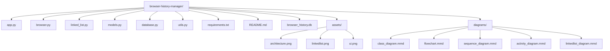
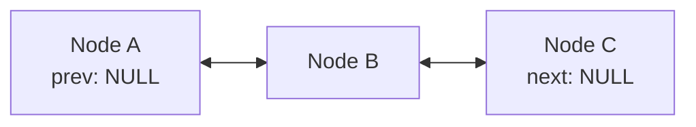
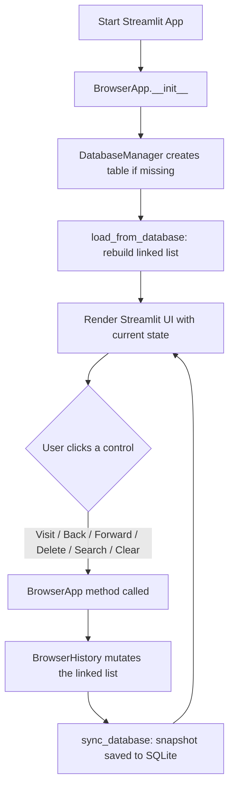
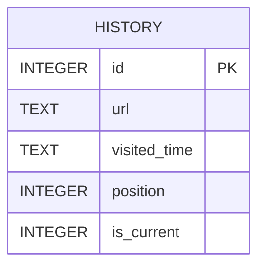
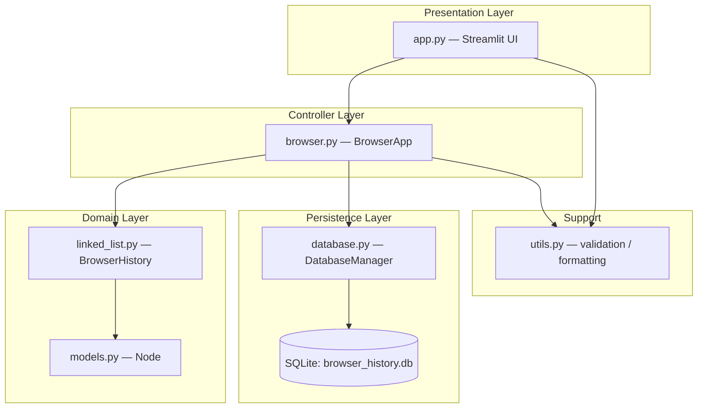
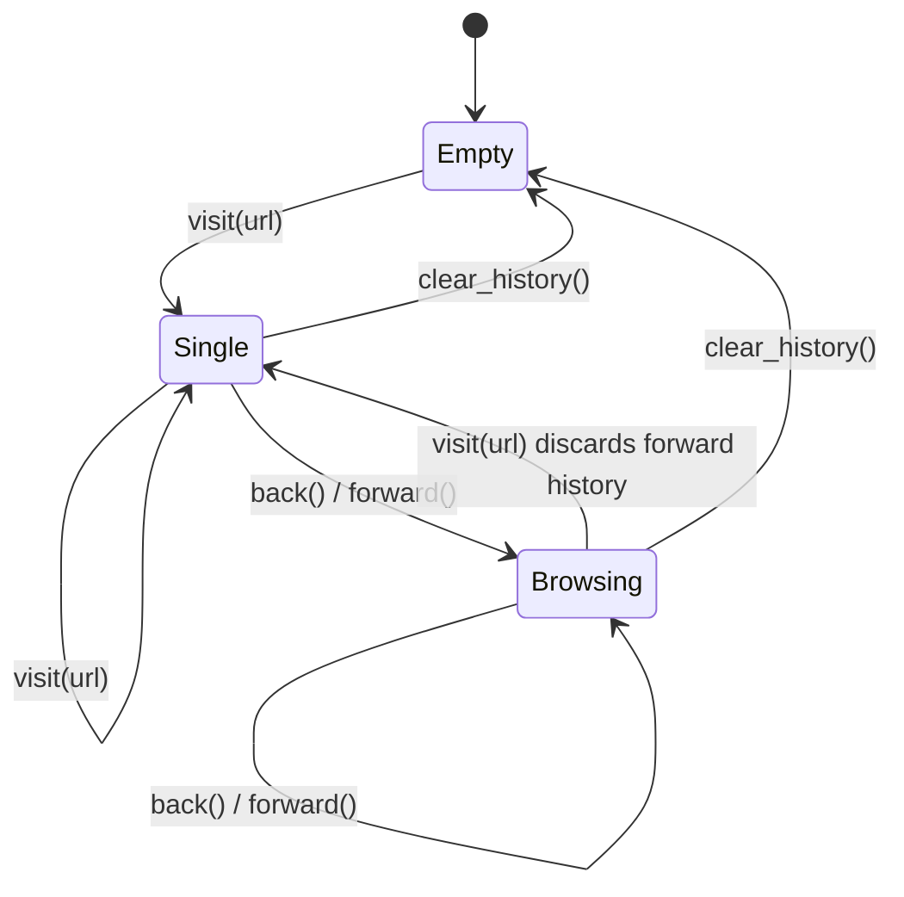
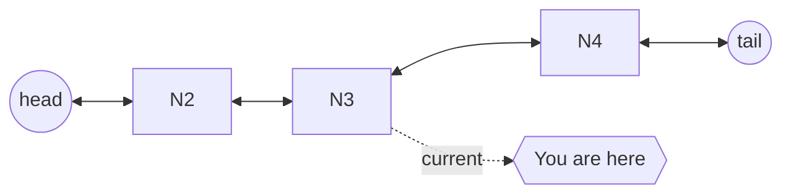

# 🧭 PathWeaver — Browser History Manager (Doubly Linked List Edition)

> A fully working educational simulation of how Chrome, Edge, and Firefox manage tab history internally — built from scratch on a hand-rolled **Doubly Linked List**, wrapped in a modern **Streamlit** interface, and backed by **SQLite** for persistence across sessions.

---

## 📖 Table of Contents

1. [Overview](#-overview)
2. [Problem Statement](#-problem-statement)
3. [Objectives](#-objectives)
4. [Features](#-features)
5. [Tech Stack](#-tech-stack)
6. [Folder Structure](#-folder-structure)
7. [Installation](#-installation)
8. [Running the Application](#-running-the-application)
9. [Screenshots](#-screenshots)
10. [How Browser History Works](#-how-browser-history-works)
11. [How a Doubly Linked List Works](#-how-a-doubly-linked-list-works)
12. [Why Doubly Linked List Instead of Singly Linked List](#-why-doubly-linked-list-instead-of-singly-linked-list)
13. [SQLite Explanation](#-sqlite-explanation)
14. [Project Workflow](#-project-workflow)
15. [Complete Code Explanation](#-complete-code-explanation)
16. [Database Explanation](#-database-explanation)
17. [Algorithms Explained Step-by-Step](#-algorithms-explained-step-by-step)
18. [Time & Space Complexity Summary](#-time--space-complexity-summary)
19. [Educational Section: Linked Lists 101](#-educational-section-linked-lists-101)
20. [Advantages](#-advantages)
21. [Limitations](#-limitations)
22. [Future Enhancements](#-future-enhancements)
23. [Learning Outcomes](#-learning-outcomes)
24. [Credits](#-credits)
25. [License](#-license)

---

## 🌐 Overview

**PathWeaver** is an educational, production-quality Python project that recreates the navigation engine sitting behind every web browser's **Back** and **Forward** buttons. Instead of hiding that engine behind compiled C++ (which real browsers use), this project exposes it completely — every node, every pointer, every traversal — using a hand-written **Doubly Linked List** in pure Python.

On top of that data structure sits a polished, dark-themed **Streamlit** dashboard that lets you *see* the linked list as you interact with it: visiting pages, going back and forward, searching history, and deleting specific entries — all while a live visualization redraws the chain of nodes with the current page highlighted.

Every action is also mirrored into a local **SQLite** database, so closing and reopening the app restores your exact browsing session, including which page you were "on."

---

## ❓ Problem Statement

Modern browsers must answer a deceptively simple question extremely efficiently, millions of times a day:

> *"Given the page I'm on right now, what was I looking at before, and can I get back to where I just came from if I change my mind?"*

A naive approach — storing history in a plain array/list and tracking an index — works, but it doesn't reflect *why* browsers actually use linked structures internally: pages are visited in an unpredictable, branching order, history needs to be truncated instantly when you navigate away from a "future" page, and insertion/removal at the current position must be cheap regardless of how long the history list grows.

This project solves that problem the same way real browser engines conceptually do: by modeling each visited page as a **node** with `prev` and `next` pointers, and a `current` pointer that walks back and forth across that chain.

---

## 🎯 Objectives

- Demonstrate a **fully functional Doubly Linked List** with no reliance on Python's built-in `list` as primary storage.
- Faithfully reproduce real browser navigation semantics: `visit`, `back`, `forward`, and **forward-history truncation** on new navigation.
- Persist all state to **SQLite**, so history survives an application restart.
- Provide a **modern, visual, interactive UI** using Streamlit — not a bare console app.
- Make the internal data structure *visible* via a live linked-list diagram in the UI.
- Serve as a clean, heavily commented **teaching reference** for students learning linked lists, OOP, and Streamlit together.

---

## ✨ Features

| Category | Feature |
|---|---|
| Navigation | Visit, Back, Forward, with real browser-style forward-history truncation |
| Search | Case-insensitive substring search across all visited URLs |
| Deletion | Delete any specific page, or clear entire history in one click |
| Persistence | Automatic SQLite save after every mutation; auto-reload on startup |
| Visualization | Live, arrow-linked diagram of the doubly linked list with the current node glowing |
| UI/UX | Wide layout, sidebar metrics, cards, expanders, progress indicator, dataframe table |
| Robustness | Handles empty history, duplicate visits, invalid URLs, and SQLite errors gracefully |
| Code Quality | Full type hints, PEP-8, docstrings on every class/function, zero duplicated logic |

---

## 🛠 Tech Stack

- **Python 3.12+**
- **Streamlit** — UI framework
- **SQLite3** (Python standard library) — local persistence, zero external services
- **Object-Oriented Programming** — `Node`, `BrowserHistory`, `DatabaseManager`, `BrowserApp`
- **Doubly Linked List** — the core data structure for all history operations

No Flask, Django, React, JavaScript frameworks, external databases, or cloud services are used. Everything runs 100% locally.

---

## 📁 Folder Structure

```
browser-history-manager/
│
├── app.py                      # Streamlit UI — the only file that renders anything
├── browser.py                  # BrowserApp controller — connects linked list + database
├── linked_list.py               # BrowserHistory — the core Doubly Linked List
├── models.py                    # Node dataclass — one entry in the linked list
├── database.py                  # DatabaseManager — all SQLite operations
├── utils.py                     # URL validation, normalization, formatting helpers
├── requirements.txt              # Python dependencies
├── README.md                     # You are here
├── browser_history.db            # SQLite database (auto-created on first run)
│
├── assets/
│   ├── architecture.png          # (placeholder) architecture screenshot
│   ├── linkedlist.png            # (placeholder) linked-list visualization screenshot
│   └── ui.png                    # (placeholder) full UI screenshot
│
└── diagrams/
    ├── class_diagram.mmd
    ├── flowchart.mmd
    ├── sequence_diagram.mmd
    ├── activity_diagram.mmd
    └── linkedlist_diagram.mmd
```

### Folder Structure Diagram



---

## ⚙️ Installation

**Prerequisites:** Python 3.12 or later installed on your system.

```bash
# 1. Clone or download the project folder
cd browser-history-manager

# 2. (Recommended) Create a virtual environment
python -m venv venv
source venv/bin/activate        # On Windows: venv\Scripts\activate

# 3. Install dependencies
pip install -r requirements.txt
```

---

## ▶️ Running the Application

```bash
streamlit run app.py
```

Streamlit will start a local server (typically at `http://localhost:8501`) and open the app in your default browser. The SQLite database file `browser_history.db` is created automatically in the project folder on first run — no manual setup required.

---

## 📸 Screenshots

> Screenshots are placeholders — replace with your own captures after running the app.

| Full Dashboard | Linked List Visualization |
|---|---|
| `assets/ui.png` | `assets/linkedlist.png` |

| Application Architecture |
|---|
| `assets/architecture.png` |

---

## 🌍 How Browser History Works

Every time you visit a new page, a real browser:

1. Records the page in a history stack-like structure.
2. Moves the "current" pointer to that new page.
3. **Discards every page that was ahead of you** if you had previously gone "Back" and then navigated somewhere new — this is why pressing Forward stops working the moment you visit a new URL after going back.

Pressing **Back** does not delete anything — it simply moves the current pointer one step toward the past. Pressing **Forward** moves it one step toward the future, but only if that future still exists (i.e., hasn't been overwritten by a new visit).

PathWeaver implements exactly this model with a `BrowserHistory` object exposing `visit()`, `back()`, and `forward()` — see [`linked_list.py`](#linked_listpy).

---

## 🔗 How a Doubly Linked List Works

A **Doubly Linked List (DLL)** is a chain of **nodes**, where each node stores:

- Its own data (in our case, a `url` and `visited_time`)
- A pointer to the **previous** node (`prev`)
- A pointer to the **next** node (`next`)



Unlike an array, nodes are **not stored in contiguous memory** — each node only knows about its immediate neighbours. This is what makes insertion and deletion at any known position an **O(1)** operation: you just rewire a handful of pointers, instead of shifting every element after it like an array would require.

In PathWeaver, the `head` is the oldest visited page, the `tail` is the newest, and `current` is wherever the user has navigated to via Back/Forward — which may be anywhere in between.

---

## ⚖️ Why Doubly Linked List Instead of Singly Linked List

A **Singly Linked List** only has a `next` pointer — you can walk forward, but not backward, without re-traversing from the head every time.

Browser history fundamentally needs **bidirectional traversal**: the Back button must move backward in O(1) time, just as the Forward button must move forward in O(1) time. With a singly linked list, moving "back" would require either:

- Storing a separate stack of visited positions (extra memory + bookkeeping), or
- Re-traversing from the head every single time (O(n) per Back click — unacceptably slow for a feature used constantly).

A **Doubly Linked List** solves this natively: the `prev` pointer on every node gives instant O(1) backward movement, and `next` gives instant O(1) forward movement — exactly matching how real browsers need to behave.

| | Singly Linked List | Doubly Linked List |
|---|---|---|
| Forward traversal | O(1) | O(1) |
| Backward traversal | O(n) (must restart from head) | **O(1)** |
| Extra memory per node | 1 pointer | 2 pointers |
| Matches browser Back/Forward UX | ❌ Poor fit | ✅ Natural fit |

---

## 💾 SQLite Explanation

**SQLite** is a lightweight, file-based, serverless relational database engine built into Python's standard library (`sqlite3` module) — no installation, no separate server process, no cloud account.

PathWeaver uses SQLite purely as a **persistence mirror** of the in-memory linked list:

- The linked list is the **source of truth** while the app is running.
- After every mutating action, `DatabaseManager.save_all()` wipes and rewrites the `history` table with a fresh snapshot of the current list (URL, timestamp, position, and which row is "current").
- On startup, `BrowserApp.load_from_database()` reads that table back, ordered by `position`, and rebuilds the linked list node-by-node — restoring not just the pages visited, but exactly which one was active when the app last closed.

This "snapshot rewrite" strategy keeps the sync logic simple and avoids subtle drift bugs that incremental SQL updates (`UPDATE`/`DELETE` per node) could introduce in a teaching codebase.

---

## 🔄 Project Workflow



---

## 🧩 Complete Code Explanation

### `models.py`

Defines the **`Node`** dataclass — the atomic unit of the linked list. Each `Node` stores a `url`, a `visited_time` (ISO timestamp, auto-generated if not supplied), `prev`/`next` pointers (both `None` by default), and a `db_id` used to track its corresponding SQLite row.

### `linked_list.py`

Defines **`BrowserHistory`**, the Doubly Linked List engine itself. It owns `head`, `tail`, `current`, and `size`, and implements every core operation as a pure pointer-manipulation algorithm: `visit`, `back`, `forward`, `show_current`, `show_history`, `search`, `delete_page`, `delete_forward_history`, and `clear_history`. This file has **zero knowledge of SQLite or Streamlit** — it is a self-contained, independently testable data structure.

### `database.py`

Defines **`DatabaseManager`**, the only module allowed to talk to SQLite. It creates the `history` table on first use, and exposes `save_all`, `load_all`, `clear_table`, `get_row_count`, and `is_connected`. All SQL is parameterized to avoid injection, and every method wraps its connection in a `try/except sqlite3.Error` block.

### `browser.py`

Defines **`BrowserApp`**, the controller that glues `BrowserHistory` and `DatabaseManager` together. Every public method here corresponds to one user-facing action, and automatically calls `sync_database()` after any mutation so SQLite never drifts out of sync with memory. It also defines three custom exceptions — `InvalidURLError`, `DuplicateVisitError`, `EmptyHistoryError` — so the UI layer can catch specific, meaningful error types instead of generic exceptions.

### `utils.py`

Pure helper functions with no side effects: `is_valid_url` (regex-based URL validation), `normalize_url` (adds `https://` if missing), `format_timestamp` (human-friendly date formatting), and `extract_display_name` (derives a short label like "Google" from a full URL, used in the linked-list visualization).

### `app.py`

The **only** file containing Streamlit code. It instantiates `BrowserApp` once per session (via `st.session_state`), renders the sidebar (project info, current page, total count, clear button, database status), the main navigation controls, the current-page card, the live linked-list visualization, the search box, and the full history table with per-row deletion.

---

## 🗂 Every Class Explanation

| Class | File | Responsibility |
|---|---|---|
| `Node` | `models.py` | One visited page: URL, timestamp, `prev`/`next` pointers |
| `BrowserHistory` | `linked_list.py` | The Doubly Linked List engine: all pointer logic |
| `DatabaseManager` | `database.py` | All SQLite reads/writes; table creation; health checks |
| `BrowserApp` | `browser.py` | Orchestrates `BrowserHistory` + `DatabaseManager`; validation; custom exceptions |

## 🧮 Every Function Explanation

| Function | Class | Purpose |
|---|---|---|
| `visit(url)` | `BrowserHistory` / `BrowserApp` | Insert a new node after `current`, discarding forward history first if needed |
| `back()` | `BrowserHistory` / `BrowserApp` | Move `current` one step toward `head` |
| `forward()` | `BrowserHistory` / `BrowserApp` | Move `current` one step toward `tail` |
| `show_current()` | `BrowserHistory` / `BrowserApp` | Return the node currently being viewed |
| `show_history()` | `BrowserHistory` / `BrowserApp` | Traverse and return all nodes, head to tail |
| `search(keyword)` | `BrowserHistory` / `BrowserApp` | Case-insensitive substring search across all URLs |
| `delete_page(node)` | `BrowserHistory` / `BrowserApp` | Remove a specific node, re-linking its neighbours |
| `delete_forward_history()` | `BrowserHistory` / `BrowserApp` | Remove every node after `current` |
| `clear_history()` | `BrowserHistory` / `BrowserApp` | Reset the list to empty; also clears the SQLite table |
| `load_from_database()` | `BrowserApp` | Rebuild the linked list from saved SQLite rows on startup |
| `save_to_database()` | `BrowserApp` | Snapshot the current linked list state into SQLite |
| `sync_database()` | `BrowserApp` | Convenience wrapper calling `save_to_database()` after mutations |
| `is_valid_url(url)` | `utils.py` | Regex validation of URL syntax |
| `normalize_url(url)` | `utils.py` | Ensures a consistent `https://` prefix |
| `format_timestamp(ts)` | `utils.py` | Human-readable date/time formatting |
| `extract_display_name(url)` | `utils.py` | Short label extraction for the visualization |

---

## 🗄 Database Explanation

**File:** `browser_history.db` (auto-created)
**Table:** `history`

| Column | Type | Description |
|---|---|---|
| `id` | `INTEGER PRIMARY KEY AUTOINCREMENT` | Unique row identifier |
| `url` | `TEXT NOT NULL` | The full visited URL |
| `visited_time` | `TEXT NOT NULL` | ISO-8601 timestamp of the visit |
| `position` | `INTEGER NOT NULL` | Order of the node in the list (0 = head/oldest) |
| `is_current` | `INTEGER NOT NULL DEFAULT 0` | `1` if this row was the active page when last saved |

### Database ER Diagram



### Application Architecture Diagram



### State Diagram — Current Pointer Lifecycle



### Browser Navigation Diagram



---

## 🔬 Algorithms Explained Step-by-Step

### `visit(url)`

**Purpose:** Add a newly visited page to history, mimicking real browser navigation.

**Algorithm:**
1. Validate the URL syntax; reject if invalid.
2. Normalize the URL (ensure a scheme prefix).
3. If the URL matches the current page exactly, reject as a duplicate.
4. If `current.next` is not `None` (the user had gone Back and is now visiting something new), call `delete_forward_history()` to discard the obsolete forward chain.
5. Create a new `Node`. If the list is empty, it becomes `head`, `tail`, and `current`. Otherwise, link it after `tail`, then update `tail` and `current` to point to it.
6. Persist the updated list to SQLite.

**Time Complexity:** O(1) amortized — O(k) only when k forward nodes must first be discarded.
**Space Complexity:** O(1) additional space per call.

### `back()`

**Purpose:** Move to the previously visited page.

**Algorithm:**
1. If `current` is `None` or `current.prev` is `None`, there is nowhere to go — return `None` (null navigation, handled gracefully).
2. Otherwise, set `current = current.prev`.

**Time Complexity:** O(1)
**Space Complexity:** O(1)

### `forward()`

**Purpose:** Move to the next page in the (still-valid) forward history.

**Algorithm:**
1. If `current` is `None` or `current.next` is `None`, there is nowhere to go — return `None`.
2. Otherwise, set `current = current.next`.

**Time Complexity:** O(1)
**Space Complexity:** O(1)

### `delete_forward_history()`

**Purpose:** Discard every node ahead of `current`, exactly as real browsers do the moment you navigate to a new page mid-history.

**Algorithm:**
1. Starting from `current.next`, walk forward, detaching each node's `prev`/`next` pointers as you go (to assist garbage collection).
2. Set `current.next = None` and `tail = current`.
3. Decrement `size` by the number of removed nodes.

**Time Complexity:** O(k), where k is the number of forward nodes removed.
**Space Complexity:** O(1)

### `search(keyword)`

**Purpose:** Find all visited pages whose URL contains a given substring.

**Algorithm:**
1. Traverse the list from `head` to `tail`.
2. For each node, perform a case-insensitive substring check on its `url`.
3. Collect and return all matches in chronological order.

**Time Complexity:** O(n), where n is the total number of nodes.
**Space Complexity:** O(k), where k is the number of matches returned.

### `clear_history()`

**Purpose:** Wipe all browsing history, both in memory and in SQLite.

**Algorithm:**
1. Set `head`, `tail`, and `current` to `None`, and `size` to `0` — Python's garbage collector reclaims the now-unreferenced node chain.
2. Issue a `DELETE FROM history` against SQLite.

**Time Complexity:** O(1) for the in-memory reset (no explicit per-node traversal needed); the SQLite delete is O(n) at the database level.
**Space Complexity:** O(1)

### `sync_database()` / Database Synchronization

**Purpose:** Keep SQLite as an exact, restorable mirror of the in-memory linked list after every mutation.

**Algorithm:**
1. Traverse the linked list head to tail, building a list of `(url, visited_time, position, is_current)` tuples.
2. Call `DatabaseManager.save_all()`, which wraps a `DELETE FROM history` followed by a bulk `INSERT` in a single transaction.

**Time Complexity:** O(n) per sync, where n is the current history length.
**Space Complexity:** O(n) for the temporary row list being written.

---

## 📊 Time & Space Complexity Summary

| Operation | Time Complexity | Space Complexity |
|---|---|---|
| `visit()` | O(1) amortized | O(1) |
| `back()` | O(1) | O(1) |
| `forward()` | O(1) | O(1) |
| `show_current()` | O(1) | O(1) |
| `show_history()` | O(n) | O(n) |
| `search()` | O(n) | O(k) matches |
| `delete_page()` | O(1) (direct reference) | O(1) |
| `delete_forward_history()` | O(k) discarded nodes | O(1) |
| `clear_history()` | O(1) in-memory | O(1) |
| `sync_database()` | O(n) | O(n) |
| `load_from_database()` | O(n) | O(n) |

---

## 📚 Educational Section: Linked Lists 101

### What is a Doubly Linked List?

A linear data structure made of nodes, where each node holds data plus two pointers — one to the previous node, one to the next — allowing traversal in **both directions**.

### Why Do Browsers Use This Kind of Structure?

Because Back/Forward navigation is inherently bidirectional and needs to support truncating "the future" the instant a new page is visited mid-history — operations that map naturally onto pointer rewiring rather than array index shuffling.

### Difference Between Arrays and Linked Lists

| | Array | Linked List |
|---|---|---|
| Memory layout | Contiguous | Scattered, connected via pointers |
| Access by index | O(1) | O(n) |
| Insert/delete at known position | O(n) (shifting) | O(1) (pointer rewire) |
| Fixed size (in some languages) | Often yes | Never — grows dynamically |

### Difference Between Singly and Doubly Linked Lists

| | Singly Linked List | Doubly Linked List |
|---|---|---|
| Pointers per node | 1 (`next`) | 2 (`prev`, `next`) |
| Backward traversal | Not supported directly | Native O(1) |
| Memory overhead | Lower | Slightly higher |
| Browser history fit | Poor | Excellent |

### Real-World Applications of Doubly Linked Lists

- Browser history (this project!)
- Undo/redo stacks in text editors and design tools
- Music/video playlist "previous/next" navigation
- LRU (Least Recently Used) cache implementations
- Navigation systems in operating system file explorers

### Advantages of Doubly Linked Lists

- O(1) insertion/deletion at any known node.
- Native bidirectional traversal.
- No need to shift elements like arrays do.

### Disadvantages of Doubly Linked Lists

- Higher memory overhead (two pointers per node instead of zero or one).
- No O(1) random access by index — must traverse from `head` or `tail`.
- Slightly more complex pointer bookkeeping during insert/delete.

---

## ✅ Advantages (of this Project)

- Clear, isolated separation between data structure, persistence, and UI layers.
- Fully type-hinted, PEP-8 compliant, heavily documented codebase.
- Realistic browser semantics, not a simplified toy version.
- Visual, interactive demonstration — not just console output.

## ⚠️ Limitations

- Single-user, local-only application (no multi-user concurrency handling).
- SQLite "snapshot rewrite" sync strategy is simple but not optimized for very large histories (thousands of entries).
- No real network requests are made — URLs are stored and displayed, not actually fetched/rendered.

## 🚀 Future Enhancements

- Add tabs (multiple independent `BrowserHistory` instances) to simulate multi-tab browsing.
- Add a "Most Visited" analytics panel using SQL aggregation.
- Add bookmark/favorites support as a separate linked structure.
- Export/import history as JSON.
- Add unit tests with `pytest` for full coverage of edge cases.

## 🎓 Learning Outcomes

By studying or extending this project, you will understand:

- How to implement a Doubly Linked List from first principles in Python.
- How to cleanly separate data structures, persistence, and UI in a real application.
- How to build a polished, interactive dashboard using Streamlit.
- How to keep an in-memory data structure synchronized with a SQL database.
- How real browsers conceptually manage navigation history.

## 🙌 Credits

Built by **Reddy Santosh Kumar** as an educational demonstration of Doubly Linked List internals.

## 📄 License

This project is released under the [MIT License](https://opensource.org/licenses/MIT) — free to use, modify, and distribute for educational purposes.
